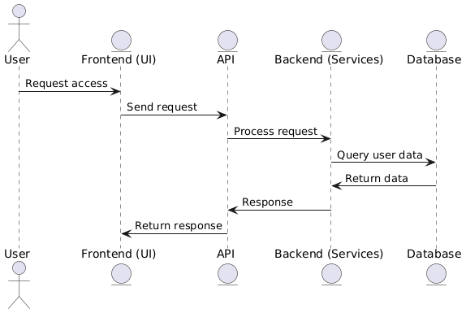

# System Architecture Overview

## Introduction

This document provides an overview of the system architecture for the **partner service platform**. The system is designed to offer a set of configurable services to a variety of partners. Each partner can access different functionalities, with a tailored configuration of permissions and services. The platform supports multiple user types, each with specific restrictions and capabilities, as detailed below.

---

## 📌 Key Components of the System

### **Partners**
- Partners are external entities that are provided with a set of services by the system.
- Each partner's services are customizable, and their permissions can be configured independently.
- Partners are associated with users who access the services based on the partner's configuration.

### **Users**
- Users are categorized into four distinct types: **Guest, Basic, Company, and Advanced**.
- Each user type has its own set of restrictions based on session time, daily operations, and weekly operations.
- Users can transition between different statuses as per the business rules.

### **System Flow**
- The system handles user requests through a combination of **front-end interfaces, back-end services, and an API layer**.
- The **API layer** manages the logic for user sessions, including **status changes, authorization, and service access**.
- The **backend services** process the requests, interact with the database, and apply the necessary business rules for user status and operations.

---

## 👤 User Types and Statuses

| **User Type** | **Session Time**       | **Daily Operations**                 | **Weekly Operations**         | **Possible Transitions**                    |
|--------------|------------------------|--------------------------------------|-------------------------------|---------------------------------------------|
| **Guest**    | 20 minutes             | Max 5 operations per day             | Max 20 operations per week     | guest → basic → advanced                    |
| **Basic**    | No limit after KYC     | Max 20 operations per day            | Max 50 operations per week     | basic → advanced, advanced → basic, advanced → guest |
| **Company**  | No limit               | No restrictions                      | No restrictions               | company → advanced, advanced → company     |
| **Advanced** | No limit               | No restrictions                      | No restrictions               | advanced → basic → guest                    |

---

## 📊 System Architecture Diagram

The system architecture involves interactions between **users, the front-end, API, backend services, and the database**.  
Users access the services through the front-end, which communicates with the API to request and process data. The **backend services** handle the core logic and interact with the database to retrieve and update user data.

